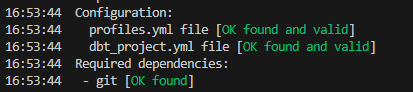
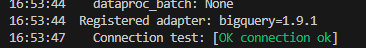

# Contexto

Este é o projeto DBT onde iremos trabalhar para construir um Data Warehouse (DW) ao longo do Bootcamp de Analytics Engineering com DBT e Big Query.

Data sources: arquivos CSV da empresa Adventure Works, que comercializa produtos e acessorios para a prática de esportes.

# Upload de dados no BigQuery

1 - Crie um dataset chamado data_lake usando o script [01_create_dataset.sql](scripts/setup/01_create_dataset.sql).

2 - Faça upload dos arquivos CSV disponibilizados [aqui](data) no dataset criado acima.

# Primeiros passos

1 - Clone este repositório para a sua máquina (substituir a tag <nome_do_repositorio>):
```
git clone https://github.com/devdata-git/<nome_do_repositorio>.git
```

2 - Dentro da pasta do projeto DBT:
```
# Crie um virtual environment
python3 -m venv dbt_env

# Ative o virtual environment
source dbt_env/bin/activate

# Instale os DBT core e DBT adapter
pip install -r requirements.txt
```

3 - Baixe o arquivo json keyfile gerado para o seu service account e coloque-o na pasta raiz do projeto DBT.
 * No GCP console, vá em IAM & Admin > Service Accounts > Selecione o service account que quer usar > Keys > Add Key > Create new key.

4 - Configure a conexão no arquivo [profiles.yml](profiles.yml)
 *  keyfile: path/para/keyfile.json (⚠️ lembre-se de adicionar este arquivo ao [.gitignore](.gitignore))
 *  project: nome-do-projeto-bigquery

5 - Teste o projeto DBT:
```
dbt debug
```
Output esperado:





# Comandos DBT

-> Processar todos os modelos 
```
dbt run
```

-> Processar todos os modelos + testes
```
dbt build
```

-> Processar um modelo específico
```
dbt build --select model_name
OU
dbt build -s model_name
```

-> Compilar um modelo (o código compilado estará disponível em /target/compiled)
```
dbt compile --select model_name
OU
dbt compile -s model_name
```

-> Processar todos os modelos + testes, excluindo a pasta "examples" e passando variáveis
```
dbt build --exclude "examples" --vars '{"run_date":"2021-07-01"}'
```

-> Processar snapshots
```
dbt sapshot
OU
dbt sapshot --select snapshot_name
```

-> Processar seeds
```
dbt seed
OU
dbt seed --select seed_name
```

-> Processar apenas unit tests de um modelo
```
dbt test --select "model_name,test_type:unit"
```

-> Excluir unit tests de uma run
```
dbt build --exclude-resource-type unit_test
```

-> Lista completa de comandos [aqui](https://docs.getdbt.com/reference/dbt-commands)

